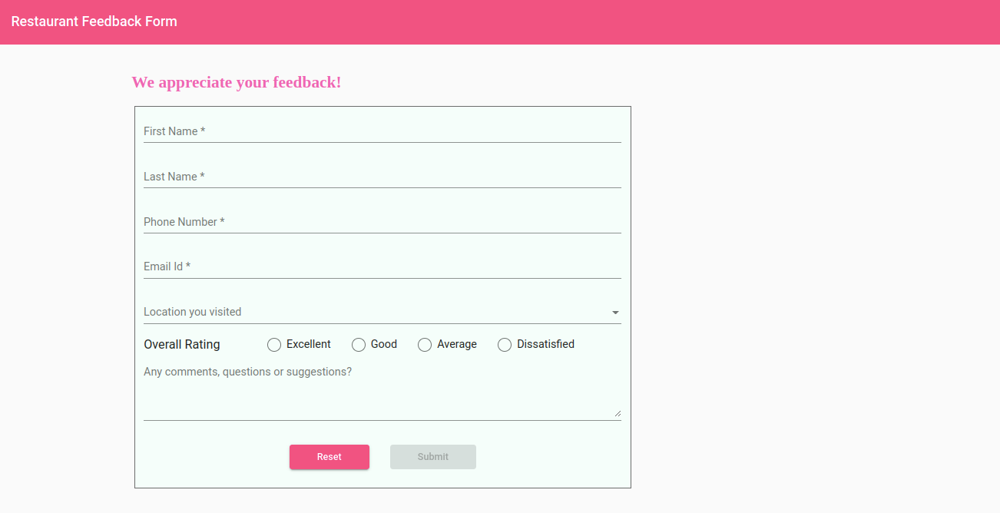
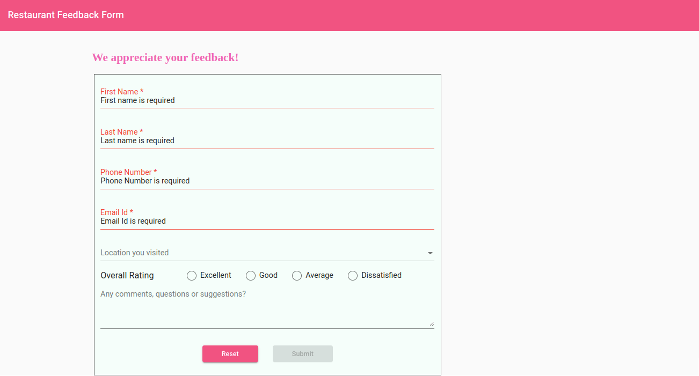
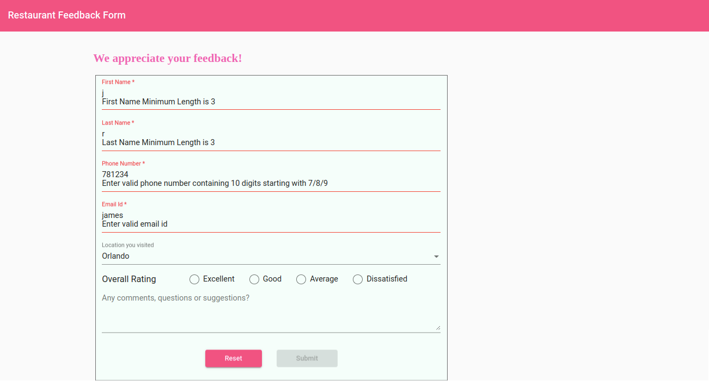
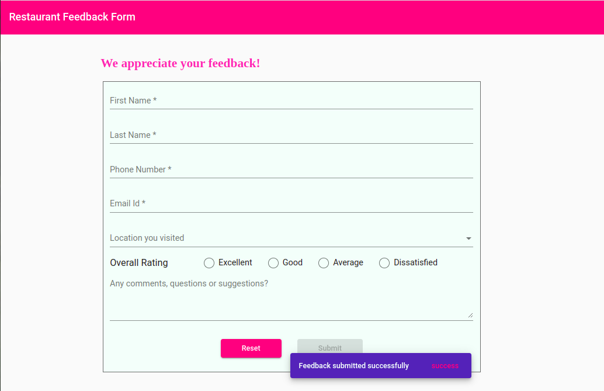

## Practice: Develop a Restaurant Feedback Form for Fine Dine Restaurant

This practice contains 1 exercise

### Context

Fine Dine is one of the popular restaurant having branches located in various parts of United States of America. The website provides various details about menu items, locations and ways to make reservations. They also wanted to collect feedback from the customers to improve the customer experience with them which in turn can empower positive change in their business.​

A restaurant feedback form is a dynamic tool that customers are asked to fill out in order to provide feedback about their dining experience. This form may ask for information such as the customer's name, contact details, which location they have visited and how they felt about their meal. The form may also ask for feedback about overall rating for the restaurant. Customers can use this form to provide suggestions for improvement or simply to say thanks.​

Hence the web design team at Fine Dine wants to design the feedback form for the customers to share their experience.

### Problem Statement
Develop a feedback form for Fine Dine restaurant which enables the customer to share their comments.​

Create a template driven form for the Angular application that resembles the following images.









### Task Details

The solution for this challenge can be created in 7 steps.​

- Step 1: Install Angular Material​
- Step 2: Create Data Model​
- Step 3: Include Required Modules ​
- Step 4: Create Feedback Component​
- Step 5: Define Form Layout Inside Template​
- Step 6: Display Validation error messages​
- Step 7: Display notification message on successful form submission​

#### Step 1:Install Angular Material​

- Use the boilerplate code provided for the Fine Dine application.​
- Run the command `ng add @angular/material` to install Angular Material packages.​
    - While the installation is in progress, respond to the prompts​
        - When prompted for prebuilt-theme selection, use the `indigo-pink.css` option.​
        - Respond with input “Y”, when prompted to install Angular Material typography styles​
        - Allow animations to be included and enabled


#### Step 2: Create Data Model​

- Create data model `Feedback` that reflect the form data model.​
- Create type `Feedback` in the `feedback.ts` file in the `models` folder with the following type properties:​
    - id (number)​
    - firstName (string)​
    - lastName (string)​
    - email (string)​
    - phone (number)​
    - location (string)​
    - comments (string)​
    - rating (number)​

#### Step 3:  Include Required Modules 

- Add the FormsModule in the application root module to enable forms feature.​
- Add the following modules in the application root module to create forms styled with Angular material components.​
    - MatFormFieldModule​
    - MatSelectModule​
    - MatInputModule​
    - MatRadioModule​
    - MatSnackBarModule​
    - MatButtonModule​
    - MatToolBarModule​

#### Step 4: Create Feedback Component
- Create FeedbackComponent inside the fine-dine Angular application.​
      -  `ng generate component feedback`​
- The command creates an Angular component with the name `feedback-component` and updates the import statements in the `app.module.ts` file.​
- Following should be defined inside the FeedbackComponent.​
    - Define a feedback property which reflects the form data model with empty values.​
    - Add a string array for location with the following values.​
        - `Hunts Ville, Spring Dale, Orlando, Augusta, New York​`
    - Define the constructor to create a MatSnackBar instance.​
        - `constructor (private _snackBar: MatSnackBar){ }`
        
#### Step 5: Define Form Layout Inside Template​
- Define the heading 'Restaurant Feedback Form' using `<mat-toolbar>`​
- Define a layout for form which has form controls that corresponds to form model properties like firstName, lastName, phone, email, location, rating and comments.​
- Following are the form controls with their validation criteria.​

|Form Control | Validation|
|------------|-------------|
|First Name|Should not be blank and have minimum length of 3 characters​|
|Last Name|Should not be blank and have minimum length of 3 characters​|
|Phone| Should not be blank and accepts only 10 digitted number starting with 7 or 8 or 9|
|Email|Should not be left blank and accepts valid email value|
|Location|Should select one value from the given set of drop-down values​|
|Rating|Should select one of the radio button from the group|
|Comments|No validation (Optional to type some text content)|

- Add a template reference variable to the <form> tag to access its values on form submission.​
       - `<form (ngSubmit)="onSubmit(feedbackForm)" #feedbackForm="ngForm">`​
- Use `<mat-form-field>` to create input form controls.​
- Add `ngModel` directive to each of the form control element to bind the controls with the data model properties using two-way binding syntax.​
- Add `name` attribute to each form element which Angular uses to register the element with the parent `<form>`. For e.g.​
     - `<input type="text" name="firstName" [(ngModel)]="feedback.firstName" />`   ​
- Add HTML5 attributes like required, minlength and pattern to validate the form control input values.​
- Use `<mat-select>` to create a drop-down list for location values.​
- Use `*ngFor` directive with `<mat-option>` to load the list of location values.
- Use `<mat-radio-group>` to select only one value at a time for feedback rating.​
- Use `<textarea>` which supports multi-line texts for adding comments.​
- Add `<button>` of type submit which enables form submission.​
- The Button should be made disabled by adding `[disabled]` attribute when the form is in invalid status.​
   - `<button type="submit" [disabled]="feedbackForm.invalid">Submit</button>`​
- Add `<button>` of type reset which resets the form with empty values.​

#### Step 6: Display Validation error messages
- To track form control status, add a template reference variable to each of the form control element. For e.g.​
  - `<input type="text" name="firstName"  #firstName="ngModel" [(ngModel)] = "feedback.firstName" />` ​
- Use `*ngIf` on the `<div>` element to display set of nested error messages after checking the control status (dirty, touched and invalid).

      ```html
      <div *ngIf="firstName?.invalid && (firstName?.dirty || firstName?.touched)">​
            <div *ngIf="firstName.errors?.['required']">​`
            First name is required​
            </div>​
            <div *ngIf="firstName.errors?.['minlength']">​
            First Name Minimum Length is {{firstName.errors?.['minlength']?.requiredLength}}​
            </div>​
        </div>
        ```

#### Step 7: Display notification message on successful form submission​
- Inside the FeedbackComponent class, define onSubmit() method which displays a notification message "Feedback submitted successfully" using a snack bar on successful form submission.
 ```Js
    this._snackBar.open('Feedback submitted successfully', 'success', {​
                    duration: 5000,​
                    panelClass: ['mat-toolbar', 'mat-primary']​
                    })
```
- After successful form submission, reset the form with empty values by calling resetForm() method of feedbackForm object.


